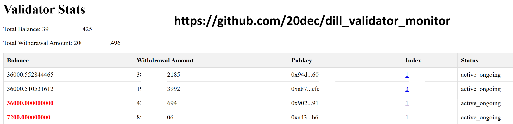

# 🧪 dill_validator_monitor

A simple monitoring tool built with Node.js and a static HTML frontend to track validator status.



---

## 📦 Installation

Install the required Node.js dependencies:

```bash
npm install express axios https-proxy-agent cors
```

Change your publickey in entries in server_noproxy.js or server_proxy.js file

If you use proxy, change proxy port too

---

## 🚀 Running the Server

To start the server, run:

```bash
node server.js
```

You can use tools like `screen` or `pm2` to keep it running in the background:

```bash
screen -S dill

node server.js
```

```bash
pm2 start server.js
```

> ⚠️ Note: use correct version file when run server (server_noproxy.js or server_proxy.js)

---

## 🌐 Viewing the Dashboard

### Option 1: Open Locally

Simply open the `index.html` file in your browser.


---

### Option 2: Use with Web Server

To serve the frontend from a web server (e.g., Apache or Nginx):

1. **Run the Node.js server**  
   Use `screen`, `pm2`, or another method to keep the server running:
   ```bash
   screen -S dill

   node server.js
   ```
   
   ```bash
   pm2 start server.js
   ```

> ⚠️ Note: use correct version file when run server (server_noproxy.js or server_proxy.js)


2. **Deploy `index.html` to your web server**  
   For example, with Apache:
   ```bash
   /var/www/html/dill_abcxyz/index.html
   ```

3. **Edit the `index.html` file (line 45)**  
   Replace:
   ```js
   http://localhost:3000/dill_validators
   ```
   With:
   ```js
   http://your-domain.com:3000/dill_validators
   ```

4. **Allow port 3000** through your server's firewall:
   ```bash
   sudo ufw allow 3000/tcp
   ```

---

## 🛠️ Notes

- The backend acts as a proxy to fetch validator data using HTTPS requests.
- Make sure your domain supports cross-origin requests if serving `index.html` from a different host.
- You can configure your server to reverse proxy the Node.js server to avoid exposing port 3000 directly.

---

## 📍 Validator Balance Notes

If you see a balance highlighted in red, it means your validator has either **just withdrawn rewards** or there may be a **problem** with it.  
You can check further details by clicking on the validator number in the **Index** column.

---

## 🧾 License

This project is licensed under the [MIT License](LICENSE).

---

## 🙌 Contributing

Pull requests are welcome. For major changes, please open an issue first to discuss what you would like to change.

---

## 📫 Contact

For questions or suggestions, feel free to open an issue or contact the project maintainer.
Telegram: @dec20
